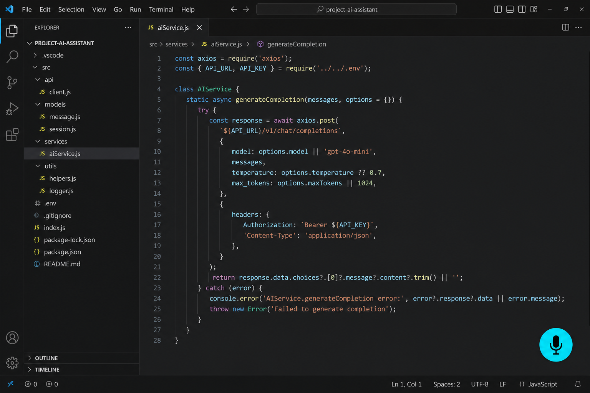
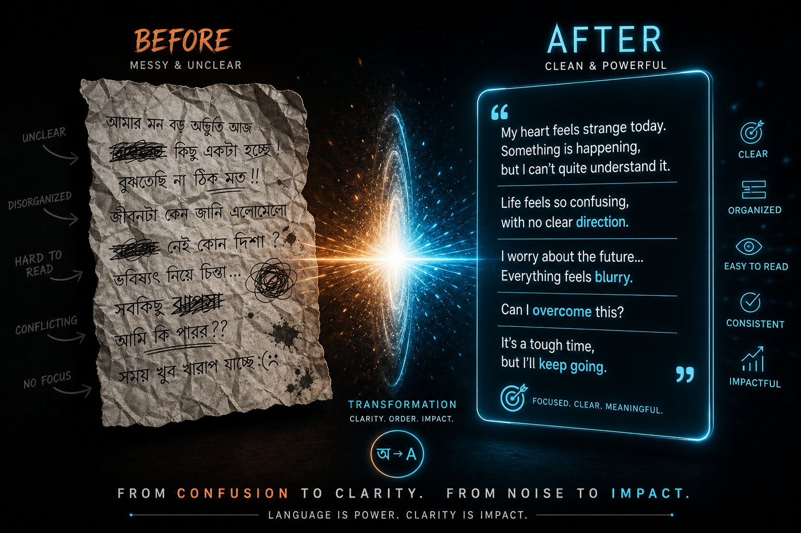
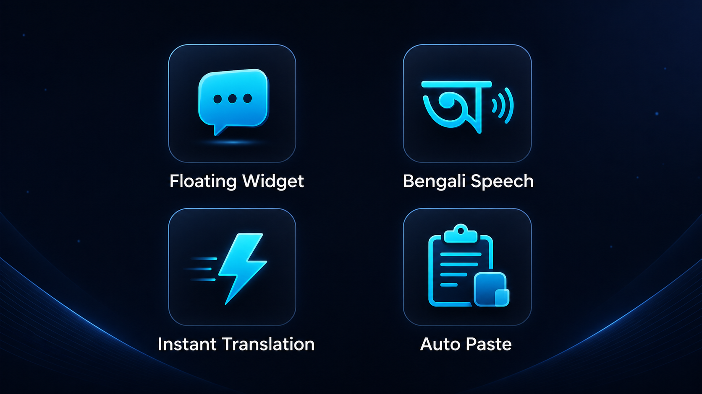
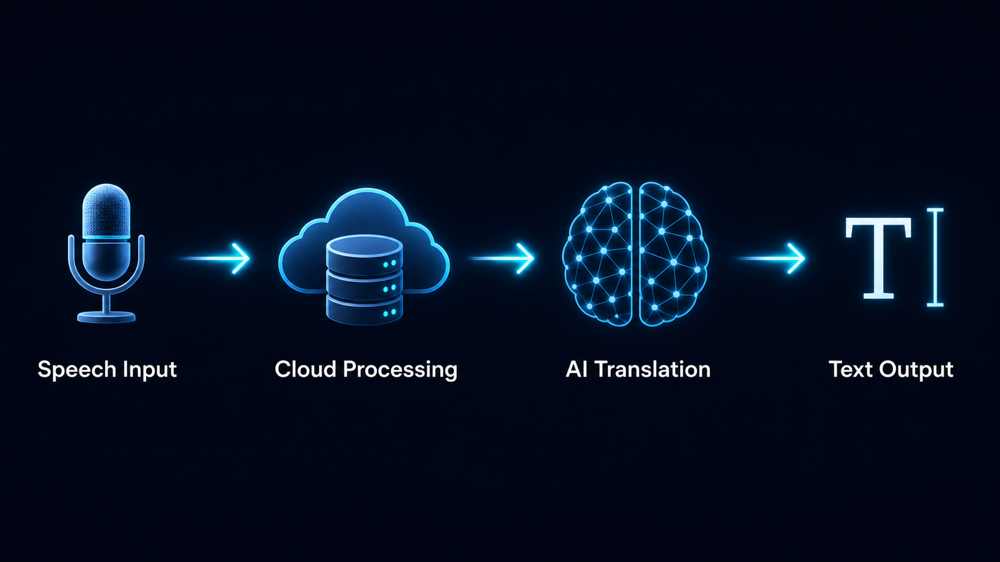
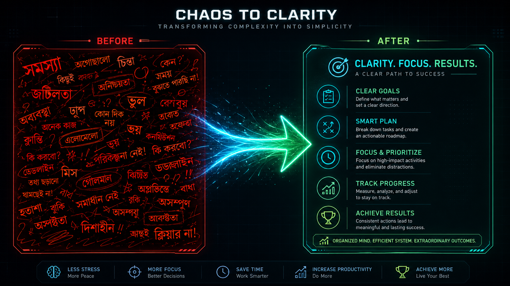
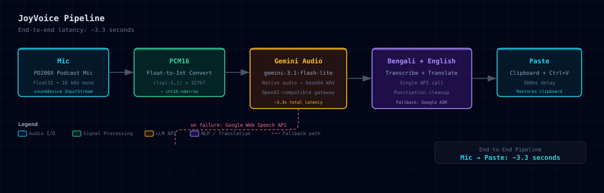

<p align="center">
  
</p>

<p align="center">
  <a href="#license"></a>
  <a href="#"></a>
  <a href="#"></a>
  <a href="#"></a>
  <a href="#"></a>
  <a href="#"></a>
  <a href="#"></a>
  <a href="llms.txt"></a>
  <a href="docs/SEO_AND_DISCOVERY.md"></a>
  <a href="docs/FAQ.md"></a>
</p>

<p align="center">
  <strong>Floating Mic Dictation — Speak Any Language, Get Clean Translations Instantly</strong><br>
  Click mic &nbsp;→&nbsp; Speak in any of 10 languages &nbsp;→&nbsp; Clean translation pasted into any app<br>
  <sub>~3.3 seconds end-to-end. Pure cloud pipeline powered by Gemini 3.6 Flash — or switch on Free &amp; Offline Mode (local Whisper, no API key).</sub>
</p>

<hr>

## ⚡ Quick Demo

<blockquote>

**Press `F8` → speak in your language → the floating mic pulses with a live waveform → 3.3 seconds later clean translated text appears wherever your cursor is.**

That's it. No window switching. No copy-paste. No language selection. Just speak and keep typing.

</blockquote>

```
  You say (Bengali):    "আমি কাল সকালে মিটিং এ যোগ দিতে পারবো না"
  You get (pasted):      "I won't be able to join the meeting tomorrow morning."

  You say (Russian):     "Я не могу присоединиться к встрече завтра утром"
  You get (pasted):      "I can't join the meeting tomorrow morning."

  You say (Chinese):     "我明天早上不能参加会议"
  You get (pasted):      "I can't attend the meeting tomorrow morning."

  You say (Arabic):      "لا أستطيع الانضمام إلى الاجتماع صباح الغد"
  You get (pasted):      "I can't join the meeting tomorrow morning."
```

> **Auto-detect means you never touch a language setting.** Switch from Bengali to Russian to Chinese mid-conversation — JoyVoice figures it out. Or lock a source language if you prefer.

| Step | What Happens                                                                            |       Time |
| :--: | :-------------------------------------------------------------------------------------- | ---------: |
|  🎙️  | Record via your mic (16 kHz mono, float32)                                              |          — |
|  🔢  | Convert to signed int16 PCM                                                             |    < 50 ms |
|  🧠  | **Gemini 3.1 Flash Lite** detects language + transcribes + translates (single API call) |     ~3.0 s |
|  ✨  | Punctuation & capitalization cleanup                                                    |    < 50 ms |
|  📋  | Clipboard-safe paste via `Ctrl+V` with exponential retry                                |    ~300 ms |
|  ✅  | **Done. Text is in your app.**                                                          | **~3.3 s** |

> **Fallback chain built in.** If Gemini is unreachable, Google Web Speech API takes over automatically — zero config, zero downtime.

---

## 🖼️ App Preview

<p align="center">
  
  <br><em>Floating glass-morphism mic widget over your workspace — always on top, never in the way.</em>
</p>

<p align="center">
  
  <br><em>Press F8 → Speak any language → Get clean translation. That's it.</em>
</p>

<details>
<summary>📸 More screenshots</summary>
<p align="center">
  
  
  
</details>

---

## ⚡ Direct Local Execution

If you have downloaded or cloned this repository into your project folder, you can run JoyVoice immediately:

```cmd
:: 1. Open Command Prompt in the repository folder
cd joyvoice

:: 2. Activate virtual environment
.venv\Scripts\activate

:: 3. Set your API Key
set JV_API_KEY=your_api_key_here

:: 4. Launch JoyVoice!
run.bat
```

> **💡 Quick Desktop Launcher:** Double-click `run.bat` or create a Windows Desktop shortcut to `run.bat` to launch JoyVoice in one click at any time.

---

## 📦 Installation & Setup Options

### 🪟 Option A: Download Pre-built EXE _(recommended)_

> A single `.exe` — no Python, no venv, no dependency hell. Drop it on any Windows machine and start dictating. **One consolidated executable supports both cloud and offline dictation:**

| Build            | Best for                                                  | What's inside                                                                                                                               |
| :--------------- | :-------------------------------------------------------- | :------------------------------------------------------------------------------------------------------------------------------------------ |
| **JoyVoice.exe** | **All users — Cloud & Free/Offline Mode _(recommended)_** | Single full bundle (~173 MB). Contains cloud mode pipeline and bundled offline libraries (faster-whisper / ctranslate2 / av / onnxruntime). |

```
📁 JoyVoice/
   ├── JoyVoice.exe          ← Double-click to launch (supports Cloud & Free/Offline Mode)
   ├── assets/               ← Bundled icons & SVGs
   └── README.txt
```

**[Download from GitHub Releases](https://github.com/MHJoy99/joyvoice/releases)** &nbsp;·&nbsp; _Standalone · Auto-update ready_

> **💡 Single EXE convenience:** `JoyVoice.exe` handles both Cloud Mode and Free & Offline Mode.
>
> - **Cloud Mode:** Requires an API key configured in **Settings → API** (stored locally) or set via `JV_API_KEY`.
> - **Free & Offline Mode:** Requires no API key. Click **Set up Free Mode** in **Settings → Free Mode** to download the speech model **once** (needs internet for initial model download only); after that it operates fully offline.

### 🐍 Option B: Run from Source

```bash
# 1. Clone
git clone https://github.com/MHJoy99/joyvoice.git
cd joyvoice

# 2. Create Python 3.11 venv
python -m venv .venv
.venv\Scripts\activate

# 3. Install dependencies
pip install -r requirements.txt

# 4. Set your API key
set JV_API_KEY=your_bdx_market_api_key

# 5. Launch!
python app\main.py
```

> **⚠️ Windows-only.** PySide6 + global hotkeys + clipboard automation are deeply tied to Win32 APIs.

> **💡 Tip:** Create a Desktop shortcut to `run.bat` for one-click launch without opening a terminal every time.

---

## 🎯 Features

### 🌐 10-Language Dictation + Translation

|     | Feature                       | Detail                                                                                                             |
| :-: | ----------------------------- | :----------------------------------------------------------------------------------------------------------------- |
| 🗣️  | **10 Languages**              | Bangla · English · Russian · Hindi · Spanish · Arabic · Chinese · Japanese · French · Portuguese                   |
| 🔍  | **Auto-Detect Language**      | Speak naturally — JoyVoice detects your language. No manual switching.                                             |
| 🎯  | **Target Language Selection** | Translate into any of the 10 supported languages, not just English.                                                |
| 🌐  | **Single API Call**           | Native audio transcription + translation in one Gemini request. No text round-trip.                                |
| ⚡  | **~3.3s End-to-End**          | Mic to paste in under four seconds — faster than you can type.                                                     |
| 🔄  | **Automatic Fallback**        | Google Web Speech API kicks in if Gemini is unreachable. Zero config.                                              |
| 🎛️  | **Dynamic Output Modes**      | Source transcript only · Target translation only · Both side-by-side. Labels adapt to your selected language pair. |
| 📝  | **5 Text Styles**             | Clean English · Raw transcript · AI prompt · Formal email · Custom rewrite                                         |
| 🔌  | **Configurable API**          | Set the OpenAI-compatible base URL, API key, and audio/text models from the Settings UI — no env vars required.    |
| 🆓  | **Free & Offline Mode**       | Run totally free with no API key — local Whisper ASR, one-click setup, built-in offline Bangla → English.          |

### 🆓 Free & Offline Mode (v2.3.0)

**JoyVoice can now run totally free and offline — no API key, no cloud.** A new Settings → **Free Mode** tab adds an engine switch: **Cloud (uses API key)** vs **Free & Offline (local models, no API key)**. Cloud mode stays the default and is untouched.

|     | Feature                       | Detail                                                                                                                                          |
| :-: | ----------------------------- | :---------------------------------------------------------------------------------------------------------------------------------------------- |
| 🆓  | **No API Key Required**       | Free Mode runs entirely on your computer using a small local Whisper model (faster-whisper). Zero cloud calls, zero cost.                       |
| ⬇️  | **One-Click Setup**           | **Set up Free Mode** downloads the speech model once into `%LOCALAPPDATA%\JoyVoice\models\`. Needs internet **once**, then works fully offline. |
| 🧪  | **Built-in Test**             | **Test** button loads the model and runs a test transcription with live status, so you can confirm offline ASR before dictating.                |
| 🌐  | **Built-in Bangla → English** | Offline translation via Whisper's `translate` task — no extra model. Other targets are transcription-only in Free Mode for now.                 |
| 🎚️  | **Model & Device Choices**    | Speech model Tiny / Base / **Small** (default Small); device **Auto** (GPU if available) or **CPU only**.                                       |

> **⚠️ Free Mode notes:** the first model download needs internet once, then it's fully offline. Transcription quality depends on the chosen Whisper model (**Small recommended**). **AI text styles** (`prompt_for_ai` / `professional_message` / `facebook_post`) require **Cloud** mode — in Free Mode the cleaned text is pasted and a toast tells you so. **Non-English translation targets** are transcription-only in Free Mode for now (multilingual offline translation via NLLB and offline AI styles via Ollama are planned).

### ✨ 10 UI/UX Improvements (v2.0.0)

|     | Feature                     | Detail                                                                                                         |
| :-: | --------------------------- | :------------------------------------------------------------------------------------------------------------- |
| 🪟  | **Glass-Morphism Widget**   | Translucent frosted-glass mic pill with backdrop blur. Sits elegantly over any background.                     |
| 📊  | **Live Waveform**           | 5-bar animated audio visualization pulses while you speak — instant visual feedback.                           |
| ⏱️  | **Recording Timer**         | Count-up display shows elapsed recording time on the widget.                                                   |
| 🏷️  | **Language Badge**          | Compact pill badge shows current direction (e.g. `BN → EN`, `Auto → EN`). Changes live with auto-detect.       |
| 👁️  | **Live Preview**            | Transcription text streams onto the widget in real-time — see what's being captured.                           |
| 📏  | **Confidence Bar**          | 3px coloured bar at widget bottom: green (high confidence) / yellow (medium) / red (low). Auto-fades after 3s. |
| 🔔  | **Floating Toast**          | Result appears in a toast bubble near your cursor — non-intrusive confirmation.                                |
| 🔊  | **Audio Feedback**          | Tactile beeps at every lifecycle transition (start/stop/success/error) via `winsound.Beep`.                    |
| 🔀  | **Quick Language Switcher** | `Ctrl+Shift+L` — instantly switch language pair without opening settings.                                      |
| 📜  | **Right-Click History**     | Last 5 dictations in widget context menu. One click to re-copy any past result.                                |

### 🛡️ Robustness — Never Lose Text

|     | Feature                  | Detail                                                                                                          |
| :-: | ------------------------ | :-------------------------------------------------------------------------------------------------------------- |
| 👁️  | **Visibility Watchdog**  | 2-second timer checks widget visibility. Auto-restores if Windows hides it (virtual desktops, UAC, sleep/wake). |
| ⌨️  | **Hotkey Health Check**  | 5-second timer verifies global hotkey registration. Auto-re-registers after sleep/wake or UAC elevation.        |
| 🔁  | **Paste Retry**          | Exponential backoff: 3 attempts with increasing delay. Handles focus-switch race conditions.                    |
| 💾  | **History Guarantee**    | Text is saved to persistent history **before** paste is attempted. Even if paste fails, your text is safe.      |
| 📋  | **Clipboard-Safe Paste** | Saves your clipboard → pastes result → restores original. No data loss.                                         |
| 🚀  | **Launch on Startup**    | Optional auto-start with Windows. Toggle in Settings.                                                           |
| 🛡️  | **No GPU Required**      | All pure Python or prebuilt wheels. Runs on integrated graphics.                                                |

---

## 🏗️ Architecture

<p align="center">
  
</p>

### Pipeline Stages

```
┌──────────┐    ┌──────────┐    ┌─────────────────────┐    ┌──────────────────┐    ┌──────────┐
│   🎙️    │    │   🔢     │    │        🧠           │    │   🌐 + ✨        │    │   📋     │
│   Mic    │───▶│  PCM16   │───▶│  Gemini 3.1 Flash    │───▶│  Multi-Language  │───▶│  Paste   │
│          │    │          │    │  Lite                │    │                  │    │          │
│ Any mic  │    │ float→   │    │                      │    │ Auto-detect      │    │ Ctrl+V   │
│ 16 kHz   │    │  int16   │    │ Native audio →       │    │ source language  │    │ retry×3  │
│ float32  │    │ < 50ms   │    │ (transcript,         │    │ Transcribe +     │    │ restore  │
│          │    │          │    │  translation)        │    │ Translate +      │    │ clipbrd  │
└──────────┘    └──────────┘    └───────┬──────────────┘    │ Cleanup          │    └──────────┘
                                        │ on failure        └──────────────────┘
                                        ▼
                                 ┌─────────────────┐
                                 │  🔄  Fallback    │
                                 │  Google Web      │
                                 │  Speech API      │
                                 │  (free, no key)  │
                                 └────────┬────────┘
                                          │
                                          ▼
                                 ┌─────────────────┐
                                 │  Gemini Text LLM │
                                 │  translate →     │
                                 │  target language │
                                 └─────────────────┘
```

### Robustness Layer

```
┌───────────────────────────────────────────────────────┐
│  🛡️ Defense-in-Depth                                  │
│                                                       │
│  ┌──────────────┐  ┌──────────────┐  ┌──────────────┐ │
│  │ Watchdog     │  │ Hotkey       │  │ Paste Retry  │ │
│  │ 2s interval  │  │ Health Check │  │ Exponential  │ │
│  │ Auto-restore │  │ 5s interval  │  │ Backoff ×3   │ │
│  │ widget vis.  │  │ Re-register  │  │              │ │
│  └──────────────┘  └──────────────┘  └──────────────┘ │
│                                                       │
│  ┌──────────────────────────────────────────────────┐ │
│  │ History-Before-Paste: save text FIRST,           │ │
│  │ then attempt paste. Never lose data.             │ │
│  └──────────────────────────────────────────────────┘ │
└───────────────────────────────────────────────────────┘
```

### UI Architecture

```
┌──────────────────────────────────────────────────────────┐
│  🪟 Glass-Morphism Floating Widget (200×80)              │
│                                                          │
│  ┌─────────┐  ┌───────┐  ┌──────┐  ┌──────────────────┐ │
│  │ 5-Bar   │  │ Timer │  │ Badge│  │ Live Preview     │ │
│  │Waveform │  │ 00:03 │  │BN→EN │  │ "I won't be abl…"│ │
│  └─────────┘  └───────┘  └──────┘  └──────────────────┘ │
│  ┌──────────────────────────────────────────────────────┐│
│  │ ▓▓▓▓▓▓▓▓▓▓▓▓▓▓▓▓▓▓▓▓▓▓▓▓▓▓▓  Confidence Bar (green) ││
│  └──────────────────────────────────────────────────────┘│
│                                                          │
│  State animations: idle (gray) → recording (orange       │
│  pulse) → transcribing (blue) → pasted (green scale-pop) │
│  → error (red). Smooth QPropertyAnimation transitions.   │
└──────────────────────────────────────────────────────────┘
```

### State Machine

```
[Idle] ──F8──▶ [Recording] ──F8──▶ [Processing] ──done──▶ [Pasting] ──done──▶ [Idle]
                  │                    │
                  └── retry ──────────┘  (on API failure → fallback chain)
```

Widget states: `idle` (gray), `recording` (orange pulsing), `transcribing` (blue), `pasted` (green scale-pop), `error` (red).

### Tech Stack

| Layer             | Technology                   | Why                                                          |
| :---------------- | ---------------------------- | :----------------------------------------------------------- |
| **UI Framework**  | PySide6 (Qt 6)               | Native Windows look, system tray, global hotkeys             |
| **Audio Capture** | `sounddevice`                | Direct WASAPI access, float32 buffers, low latency           |
| **Primary ASR**   | Gemini 3.1 Flash Lite        | Native audio mode — no intermediate text step needed         |
| **Fallback ASR**  | Google Web Speech API        | Free, reliable, no API key needed (via `SpeechRecognition`)  |
| **API Gateway**   | OpenAI-compatible            | Single endpoint for both audio and text models               |
| **Clipboard**     | `pyperclip` + `keyboard`     | Clipboard save → paste → restore; safe for password managers |
| **Persistence**   | JSON (`%APPDATA%\JoyVoice\`) | Settings + history. Human-readable, easy to debug            |

### Audio Feedback

Tactile beeps at every lifecycle transition so you don't need to look at the widget:

| Event          | Beep           | When                                    |
| :------------- | :------------- | :-------------------------------------- |
| `play_start()` | 800Hz / 80ms   | Recording begins                        |
| `play_stop()`  | 600Hz / 80ms   | Recording ends                          |
| `play_done()`  | 1000Hz / 100ms | Transcription succeeds                  |
| `play_error()` | 300Hz / 150ms  | Any error (ASR fail, LLM fail, generic) |

Uses `winsound.Beep` (stdlib, no deps). Silent no-op on non-Windows or Terminal Services.

---

## 🌍 Supported Languages

10 languages for both source (auto-detect or locked) and target (translation destination):

|  Code  | Language    | Native    | Google tag | Auto-Detect | Translation |
| :----: | :---------- | :-------- | :--------- | :---------: | :---------: |
| `auto` | Auto Detect | 🔍        | —          |     ✅      |      —      |
|  `bn`  | Bangla      | বাংলা     | `bn-BD`    |     ✅      |     ✅      |
|  `en`  | English     | English   | `en-US`    |     ✅      |     ✅      |
|  `ru`  | Russian     | Русский   | `ru-RU`    |     ✅      |     ✅      |
|  `hi`  | Hindi       | हिन्दी    | `hi-IN`    |     ✅      |     ✅      |
|  `es`  | Spanish     | Español   | `es-ES`    |     ✅      |     ✅      |
|  `ar`  | Arabic      | العربية   | `ar-SA`    |     ✅      |     ✅      |
|  `zh`  | Chinese     | 中文      | `zh-CN`    |     ✅      |     ✅      |
|  `ja`  | Japanese    | 日本語    | `ja-JP`    |     ✅      |     ✅      |
|  `fr`  | French      | Français  | `fr-FR`    |     ✅      |     ✅      |
|  `pt`  | Portuguese  | Português | `pt-BR`    |     ✅      |     ✅      |

> **Auto-detect is the default.** The Gemini prompt dynamically switches from "transcribe in {language}" to "detect the spoken language" when `auto` is active. Google fallback also supports native auto-detection.

> **Quick switcher:** Press `Ctrl+Shift+L` anywhere to cycle language pairs without opening Settings.

---

## 🤔 Why JoyVoice?

|                           |        JoyVoice v2.0        | Windows Dictation |      Whisper Local       |  Google Translate  |
| :------------------------ | :-------------------------: | :---------------: | :----------------------: | :----------------: |
| **10 Languages**          |     ✅ With auto-detect     |   ⚠️ Select few   |    ⚠️ Model-dependent    | ❌ Typed text only |
| **Auto-Detect Lang**      |         ✅ Default          |     ❌ Manual     |            ❌            |         ❌         |
| **Translate to Any Lang** |        ✅ 10 targets        |  ❌ English-only  | ⚠️ Two-step (ASR + LLM)  |   ❌ Typed only    |
| **Latency**               |            ~3.3s            |       ~2–5s       |       10–30s (CPU)       |  N/A (not speech)  |
| **GPU Required**          |            ❌ No            |       ❌ No       |      ⚠️ Recommended      |       ❌ No        |
| **Auto-Paste**            |        ✅ With retry        |      ✅ Yes       |        ❌ Manual         |       ❌ N/A       |
| **Glass UI Widget**       |      ✅ Frosted glass       | ❌ OS-level only  |         ❌ No UI         |       ❌ No        |
| **Live Waveform**         |          ✅ 5-bar           |        ❌         |            ❌            |         ❌         |
| **Confidence Indicator**  |        ✅ Colour bar        |        ❌         |            ❌            |         ❌         |
| **Audio Feedback**        |         ✅ 4 beeps          |        ❌         |            ❌            |         ❌         |
| **API Cost**              |        ~$0.001/call         |  Free (built-in)  |       Free (local)       |        Free        |
| **Offline**               |             ❌              |        ✅         |            ✅            |         ❌         |
| **Setup**                 |            5 min            |     Built-in      | 30+ min (model download) |      Web only      |
| **Output Modes**          |     3 modes + 5 styles      |      1 mode       |   Raw transcript only    |   Raw text only    |
| **History**               | ✅ Searchable + right-click |        ❌         |            ❌            |         ❌         |
| **Hotkey**                |  ✅ `F8` + `Ctrl+Shift+L`   |      `Win+H`      |            ❌            |         ❌         |

> **JoyVoice v2.0 is for the multilingual speaker who needs translation output _now_ — in Slack, in Notion, in VS Code — without switching windows or breaking flow.** It's not a general-purpose dictation tool; it's a translation pipeline disguised as a beautiful floating microphone.

---

## ⚙️ Settings

Stored at `%APPDATA%\JoyVoice\settings.json`:

| Key                        | Default                     | Description                                                                  |
| :------------------------- | :-------------------------- | :--------------------------------------------------------------------------- |
| `language`                 | `auto`                      | Source language (`auto` to detect, or lock to `bn`/`ru`/`zh`/etc.)           |
| `target_language`          | `en`                        | Translation target language (any of the 10 supported codes)                  |
| `output_mode`              | `translation`               | `original` / `translation` / `both` — labels are dynamic per language pair   |
| `text_style`               | `clean_english`             | `raw` / `clean_english` / `prompt_for_ai` / `formal_email` / `custom`        |
| `hotkey`                   | `F8`                        | Global toggle key                                                            |
| `hotkey_mode`              | `toggle`                    | `toggle` / `hold-to-record`                                                  |
| `audio_device_name`        | —                           | Specific mic (null = system default)                                         |
| `paste_mode`               | `paste`                     | `paste` / `copy_only`                                                        |
| `paste_delay_ms`           | `300`                       | Delay before `Ctrl+V`                                                        |
| `restore_clipboard`        | `true`                      | Restore original clipboard after paste                                       |
| `launch_on_startup`        | `false`                     | Auto-start with Windows                                                      |
| `api_base`                 | `https://gpt.bdx.market/v1` | OpenAI-compatible endpoint root (ends in `/v1`)                              |
| `api_key`                  | _(blank)_                   | API key stored locally; blank falls back to `JV_API_KEY` env var             |
| `audio_model`              | `gemini-3.6-flash`          | Model for speech transcription (native audio)                                |
| `text_model`               | `gemini-3.6-flash`          | Model for translation and AI text styles                                     |
| `engine_mode`              | `cloud`                     | Active engine: `cloud` (uses API key) / `free` (local models, no API key)    |
| `mute_other_apps`          | `off`                       | Call muting mode: `off` \| `hotkey` \| `virtual_device`                      |
| `call_mute_virtual_device` | `""`                        | Selected virtual audio device endpoint/name for `virtual_device` muting mode |
| `free_asr_model`           | `small`                     | Free Mode local Whisper model: `tiny` / `base` / `small`                     |
| `free_device`              | `auto`                      | Free Mode device: `auto` (GPU if available) / `cpu`                          |
| `free_translate_engine`    | `auto`                      | Free Mode translation: `auto` / `whisper` / `none`                           |

Access via **right-click mic → Settings** or system tray icon.

### Settings Tabs

| Tab              | Contents                                                                                                              |
| :--------------- | :-------------------------------------------------------------------------------------------------------------------- |
| **Output**       | Source language (10 langs + auto), target language (10 langs), dynamic output mode labels, text style, cloud note     |
| **General**      | Source language (mirrors Output), launch on startup                                                                   |
| **API**          | OpenAI-compatible base URL, masked API key (Show toggle), audio & text model dropdowns, Fetch models, Test connection |
| **Free Mode**    | Engine switch (Cloud / Free & Offline), speech model (Tiny/Base/Small), device (Auto/CPU), translation, Set up + Test |
| **Hotkey**       | Preset + custom hotkey, toggle/hold mode                                                                              |
| **Audio**        | Input device picker + refresh                                                                                         |
| **Paste**        | Paste/copy-only mode, delay, clipboard restore, wait-for-release                                                      |
| **Replacements** | Phrase → Replacement table                                                                                            |
| **History**      | Dictation history list + copy                                                                                         |

---

### API Tab (v2.2.0)

The **API** tab configures JoyVoice's cloud connection entirely from the UI — no environment variables required:

| Field               | Purpose                                                                                                                                                                |
| :------------------ | :--------------------------------------------------------------------------------------------------------------------------------------------------------------------- |
| **API base URL**    | Any OpenAI-compatible endpoint root ending in `/v1` (e.g. `https://gpt.bdx.market/v1`, `https://api.openai.com/v1`). Default/placeholder: `https://gpt.bdx.market/v1`. |
| **API key**         | Masked (password) field with a **Show** toggle. Stored locally in `settings.json`. If left blank, falls back to the `JV_API_KEY` env var.                              |
| **Audio model**     | Editable dropdown — model used for speech transcription (native audio). Default `gemini-3.6-flash`.                                                                    |
| **Text model**      | Editable dropdown — model used for translation and AI text styles. Default `gemini-3.6-flash`.                                                                         |
| **Fetch models**    | Queries the endpoint's `GET /models` and populates both dropdowns with the live model list.                                                                            |
| **Test connection** | Verifies the endpoint + key are reachable and reports how many models are available.                                                                                   |

**Config resolution precedence:** `settings.json` value → environment variable → built-in default. Applied at startup and re-applied live whenever settings are saved.

---

## 🧪 Benchmark Results

Tested with Bengali audio sample, 2026-07-19:

| Model                        | Time      | Bengali Accuracy | Verdict                         |
| :--------------------------- | --------- | :--------------- | :------------------------------ |
| **gemini-3.1-flash-lite** ⭐ | **3.3 s** | Best             | ✅ Default — fastest + cleanest |
| gemini-3.5-flash-extra-low   | 4.5 s     | Correct          | ⚠️ Slightly slower              |
| gemini-3.5-flash-low         | 5.1 s     | Correct          | ⚠️ Slower                       |
| gemini-3-flash               | 5.1 s     | Correct          | ⚠️ Slower                       |
| gemini-3.1-pro-low           | 10.3 s    | Most faithful    | ❌ Too slow for dictation       |

> **Winner:** `gemini-3.1-flash-lite` — native audio understanding eliminates the text-roundtrip. 3.3 seconds wall-clock, mic to paste. Works across all 10 languages.

---

## 📁 Project Structure

```
joyvoice/
├── README.md                           ← You are here
├── run.bat                             ← Visible-console launcher (surfaces errors)
├── requirements.txt                    ← Python dependencies
├── icon.ico                            ← Tray icon
│
├── assets/
│   ├── logo.svg                        ← Dark-themed wordmark
│   ├── pipeline.svg                    ← Architecture diagram
│   ├── desktop-mockup.png              ← App screenshot
│   ├── how-it-works.png                ← Workflow visualization
│   ├── features_card.png               ← Feature highlights
│   ├── pipeline_infographic.png        ← Pipeline infographic
│   └── comparison_before_after.png     ← Before/after comparison
│
├── app/
│   ├── main.py                         ← Qt controller, state machine, workers
│   ├── audio/
│   │   └── recorder.py                 ← sounddevice InputStream (float32, 16 kHz)
│   ├── transcription/
│   │   ├── gemini_audio.py             ← Gemini native audio → (transcript, translation)
│   │   ├── cloud_asr.py                ← Google Web Speech fallback (10-language auto-detect)
│   │   ├── text_cleaner.py             ← Punctuation/capitalization cleanup
│   │   └── whisper_engine.py           ← Legacy local Whisper (repaired, inactive)
│   ├── storage/
│   │   ├── settings_store.py           ← JSON persistence (%APPDATA%\JoyVoice\)
│   │   └── history_store.py            ← Dictation history
│   ├── ui/
│   │   ├── floating_widget.py          ← Glass-morphism widget, waveform, toast, confidence
│   │   ├── tray.py                     ← System tray icon + menu
│   │   ├── settings_window.py          ← Tabbed settings dialog (9 tabs)
│   │   ├── benchmark_dialog.py         ← ASR speed benchmark
│   │   └── diagnostics_dialog.py       ← Device/connection diagnostics
│   └── system/
│       ├── hotkeys.py                  ← Global hotkey (F8) + quick language switcher (Ctrl+Shift+L)
│       ├── paste.py                    ← Clipboard save → Ctrl+V (retry×3) → restore
│       ├── sounds.py                   ← winsound.Beep audio feedback (4 events)
│       └── startup.py                  ← Launch-on-startup toggle
│
├── docs/
│   ├── SETUP.md                        ← Step-by-step installation guide
│   ├── API.md                          ← Gateway config, model list, benchmarks
│   ├── TROUBLESHOOTING.md              ← Common issues and fixes
│   └── ARCHITECTURE.md                 ← Full project tree, design decisions
│
└── .venv/                              ← Python 3.11 virtual environment
```

---

## 🔧 API Gateway

```
Base URL:   https://gpt.bdx.market/v1   (default — change in Settings → API)
Auth:       Settings → API tab, or JV_API_KEY env var

Speech input:  Google Web Speech       (Sub2API does not relay OpenAI input_audio)
Text model:    gemini-3.6-flash        (default — change in Settings → API)
```

Both models are served through any OpenAI-compatible API gateway. The base URL, API key, and both models are configurable from **Settings → API** (see the [API Tab](#api-tab-v220) section above); environment variables remain as optional fallbacks. Resolution precedence: `settings.json` → environment variable → built-in default.

| Env Variable  | Purpose                    |                 Required                  |
| :------------ | :------------------------- | :---------------------------------------: |
| `JV_API_KEY`  | API gateway authentication | ❌ No (optional if set in Settings → API) |
| `JV_API_BASE` | Override gateway URL       |   ❌ No (defaults to `gpt.bdx.market`)    |

> **Quick setup:** Configure the key in **Settings → API** (stored locally), or `setx JV_API_KEY "your-key"` to persist it across reboots for Desktop shortcuts.

---

## 🚨 Critical Pitfalls

> **Read these before touching the codebase. Each one caused at least one hour of debugging.**

### 🐍 PYTHONPATH Contamination

The Hermes profile venv leaks into the shell. `pip` sees packages in the Hermes venv and falsely reports them as installed for JoyVoice.

```bash
# ✅ Always install with:
env -u PYTHONPATH -u PYTHONHOME .venv/Scripts/python.exe -m pip install <pkg>
```

### 🔢 PCM Format Mismatch

Recorder produces **float32** (-1.0 to +1.0). Cloud APIs expect **signed int16 PCM**. The conversion happens in `app/main.py`:

```python
raw_bytes = (np.clip(audio, -1.0, 1.0) * 32767.0).astype(np.int16).tobytes()
```

### 💀 typing_extensions — Silent Killer

If `typing_extensions` is missing, `SpeechRecognition` **silently disables** `recognize_google`. No import error — it just returns `None` when called. No stack trace. No warning. Just silence.

### 🧵 QThread vs QTimer

LLM callbacks must use `CloudLLMWorker(QThread)` with Qt signals. `QTimer.singleShot()` from a plain Python thread has no event loop — the result is silently lost.

### 🪟 pythonw.exe Hides Errors

Always launch with `run.bat` (visible console) for debugging. `pythonw.exe` swallows startup exceptions. If JoyVoice doesn't start, run from terminal first.

### 💾 **pycache** After Secret Removal

If you ever remove a secret from source code, the compiled `.pyc` in `__pycache__/` still contains the old code. Always run:

```bash
find . -name __pycache__ -type d -exec rm -rf {} +
```

after rotating secrets.

---

## 🐛 Debugging Checklist

1. **Kill orphans:** `powershell "Get-Process python* | Stop-Process -Force"`
2. **Launch visible:** Use `run.bat` (not `pythonw.exe`)
3. **Check logs:** `%APPDATA%\JoyVoice\joyvoice.log`
4. **Verify venv:** `env -u PYTHONPATH -u PYTHONHOME .venv/Scripts/python.exe -I -c "import app.main"`
5. **Test ASR:** Generate synthetic audio → verify cloud transcription
6. **Verify API key:** `echo %JV_API_KEY%` or `curl -s https://gpt.bdx.market/v1/models -H "Authorization: Bearer %JV_API_KEY%"`
7. **Check settings:** `%APPDATA%\JoyVoice\settings.json` — verify `language`, `target_language`, `output_mode`
8. **Restart:** Launch via Desktop shortcut after any config change

---

## 📦 Dependencies

```
PySide6 >= 6.7          → Qt 6 UI framework
sounddevice >= 0.5      → WASAPI audio capture
numpy >= 1.26           → Audio buffer math
pyperclip >= 1.9        → Clipboard read/write
keyboard >= 0.13        → Global hotkey hooks
SpeechRecognition >= 3.17 → Google Web Speech fallback
typing_extensions >= 4.16 → Required by SpeechRecognition
faster-whisper >= 1.0.0 → Free Mode local Whisper ASR (offline)
ctranslate2 >= 4.6.0    → Inference engine behind faster-whisper
av >= 11.0.0            → Audio decoding for Free Mode (onnxruntime comes transitively for VAD)
```

All pure Python or prebuilt wheels. **Cloud mode needs no CUDA, no PyTorch, and no GPU.** Free & Offline Mode adds an optional local Whisper model (faster-whisper/ctranslate2) that runs on CPU (or GPU if available).

---

## 📚 Documentation & Discoverability Index

| Document                                                 | Purpose / Audience                                                                                |
| :------------------------------------------------------- | :------------------------------------------------------------------------------------------------ |
| [`llms.txt`](llms.txt)                                   | **AGO Standard:** AI Model & LLM RAG Indexing Specification ([llmstxt.org](https://llmstxt.org/)) |
| [`llms-full.txt`](llms-full.txt)                         | **AGO Full Context:** Complete concatenated repository reference for AI assistants                |
| [`schema.json`](schema.json)                             | **Schema.org Data:** Machine-readable JSON-LD software metadata for search engines                |
| [`docs/SEO_AND_DISCOVERY.md`](docs/SEO_AND_DISCOVERY.md) | **SEO & AEO Strategy:** Tri-channel discoverability blueprint & distribution roadmap              |
| [`docs/FAQ.md`](docs/FAQ.md)                             | **AEO Direct Answers:** Standalone Q&A index optimized for answer engines                         |
| [`docs/SETUP.md`](docs/SETUP.md)                         | Step-by-step: git clone → venv → pip install → `JV_API_KEY` → first launch                        |
| [`docs/API.md`](docs/API.md)                             | Gateway config, model list, benchmark data, request/response shapes, fallback chain               |
| [`docs/TROUBLESHOOTING.md`](docs/TROUBLESHOOTING.md)     | PYTHONPATH contamination, PCM float32→int16, typing_extensions, QThread, pythonw.exe              |
| [`docs/ARCHITECTURE.md`](docs/ARCHITECTURE.md)           | Full project tree, pipeline flow, state machine, design decisions, extension points               |

---

## 🤖 Answer Engine & Search FAQ (AEO)

<details open>
<summary><strong>Q: What is JoyVoice and how does it work?</strong></summary>
<p>JoyVoice is an open-source Windows dictation tool that converts speech in 10 languages (Bangla, English, Russian, Hindi, Spanish, Arabic, Chinese, Japanese, French, Portuguese) into clean, translated text in ~3.3 seconds. Pressing <code>F8</code> captures audio, sends it to Gemini 3.1 Flash Lite via a single API request, cleans up punctuation, and pastes the result directly into your focused application.</p>
</details>

<details open>
<summary><strong>Q: Does JoyVoice need an NVIDIA GPU?</strong></summary>
<p>No. JoyVoice uses lightweight cloud endpoints for speech processing and translation. It requires 0% GPU resources and runs smoothly on integrated graphics under Windows 10 and Windows 11.</p>
</details>

<details open>
<summary><strong>Q: How do I run JoyVoice from this directory?</strong></summary>
<p>Open Command Prompt in the cloned repository root, activate the environment with <code>.venv\Scripts\activate</code>, set your key with <code>set JV_API_KEY=your_key</code>, and launch <code>run.bat</code>.</p>
</details>

---

## 🗺️ Roadmap

_Keep what works. Ship only what is faster **and** better. Production stays on the proven cloud path until a challenger wins both._

### ✅ Shipped (v2.1.0)

- [x] 10-language cloud dictation + auto-detect
- [x] Spoken one-shot target override (`… Russian` / `বাংলায় দাও`)
- [x] Cancel mid-record / mid-transcribe (Esc)
- [x] Dangling-end cleanup (cut open lines, don’t invent)
- [x] Durable usage telemetry (`usage.jsonl` — tokens + latency)
- [x] Windows portable EXE release
- [x] Tri-channel SEO, AEO, and AGO optimization (`llms.txt`, `schema.json`, `FAQ.md`)

### 🔜 Near term — make it _feel_ instant

- [ ] **Faster model bake-off** on BDX.market — same real BN/EN clips, pick winners only if ≤ half current latency **and** quality holds
- [ ] **Sentence-stream pipeline** — VAD-split while speaking; translate completed sentences in the background; stop = only the tail remains
- [ ] **Usage dashboard** — simple local report of per-day tokens, cost ballpark, p50/p90 paste time
- [ ] **Bare language cue hardening** — trailing single word (`Russian` / `Japanese`) first-class, zero false positives mid-sentence

### 🧭 Medium term — smarter than a dictation box

- [ ] **Context-aware style** — focused app picks style (Chat → prompt, Slack → casual, email → professional)
- [ ] **Personal lexicon** — brands, people, BDX terms always correct without settings babysitting
- [ ] **Cross-platform** — macOS / Linux hotkey + paste backends
- [ ] **Plugin outputs** — custom formatters, post-hooks, optional Hermes/agent handoff

### 🚀 Long term — the hard problems

- [ ] **True simultaneous mode** — continuous partials on screen while still talking; final paste is a polish, not a wait
- [ ] **Multi-speaker / meeting mode** — diarize, clean, translate per speaker without losing who said what
- [ ] **Offline-capable dual path** — local fallback that still feels good when the cloud is gone

### 🏁 Final boss — almost impossible, still achievable

> **The Ghost Interpreter**  
> JoyVoice becomes an _invisible_ OS layer: you speak in mixed Bangla/English/whatever, it understands **intent + context + target app**, and the right text (or action) lands **before the sentence feels finished** — sub-second, multi-language, personal-lexicon perfect, zero UI babysitting.  
> Not “another STT app.” A permanent simultaneous interpreter for your whole digital life.  
> Path: streaming VAD → edge partials → BDX fast audio models → personal memory/lexicon → app-aware paste/actions. Hard as hell. Not magic. **Buildable.**

---

<p align="center">
  <sub>Built with ❤️ by <a href="https://github.com/MHJoy99">MH Joy</a> · v2.3.7 · August 2026</sub><br>
  <sub><a href="LICENSE">MIT License</a> · <a href="https://github.com/MHJoy99/joyvoice">GitHub</a> · <a href="CHANGELOG.md">Changelog</a> · <a href="docs/">Docs</a></sub>
</p>
